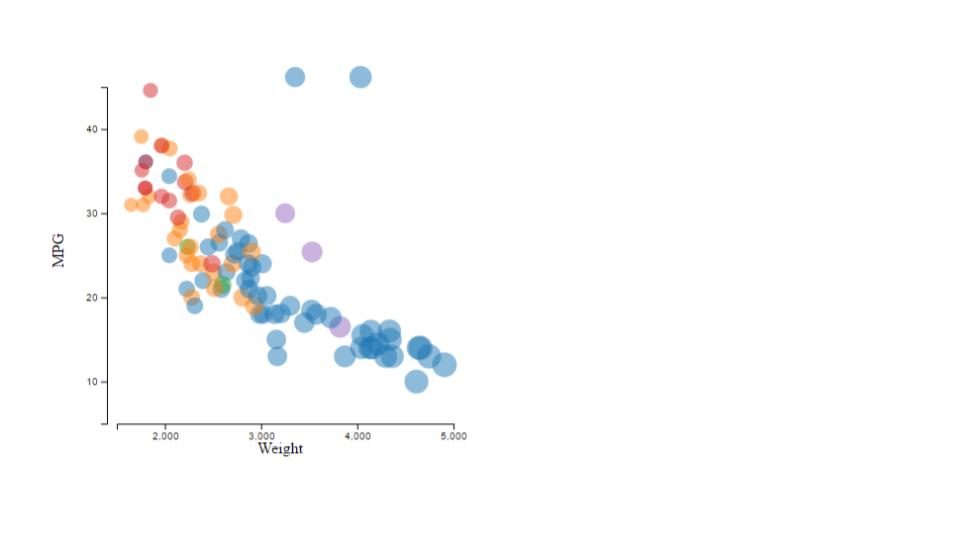
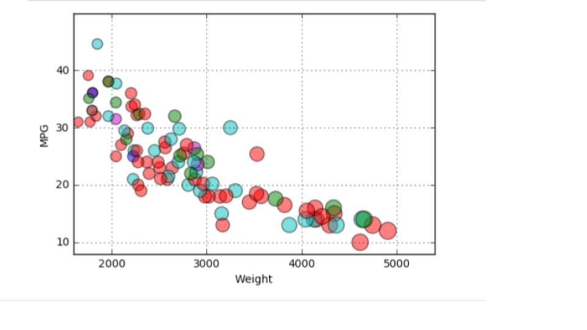
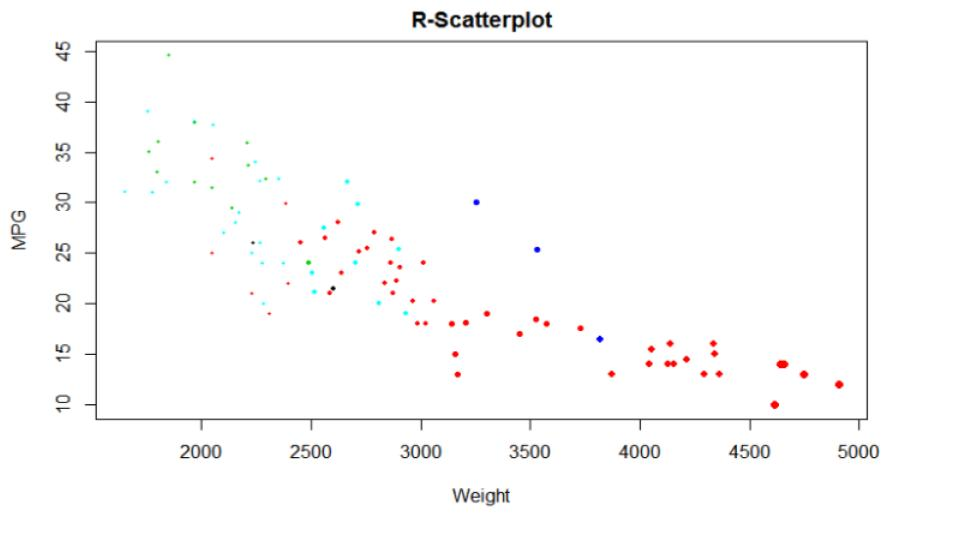
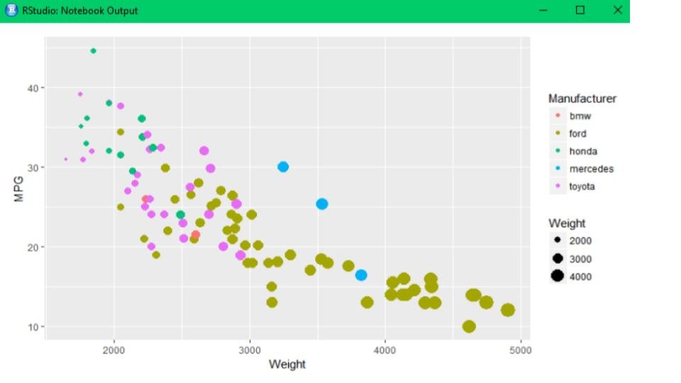
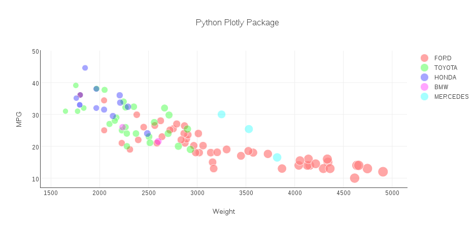
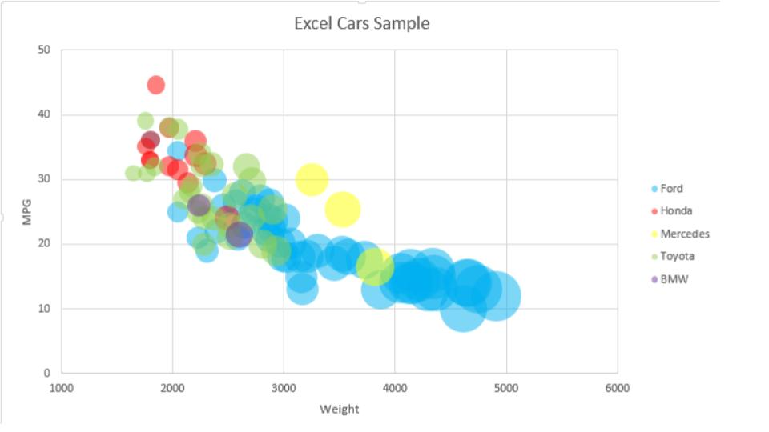
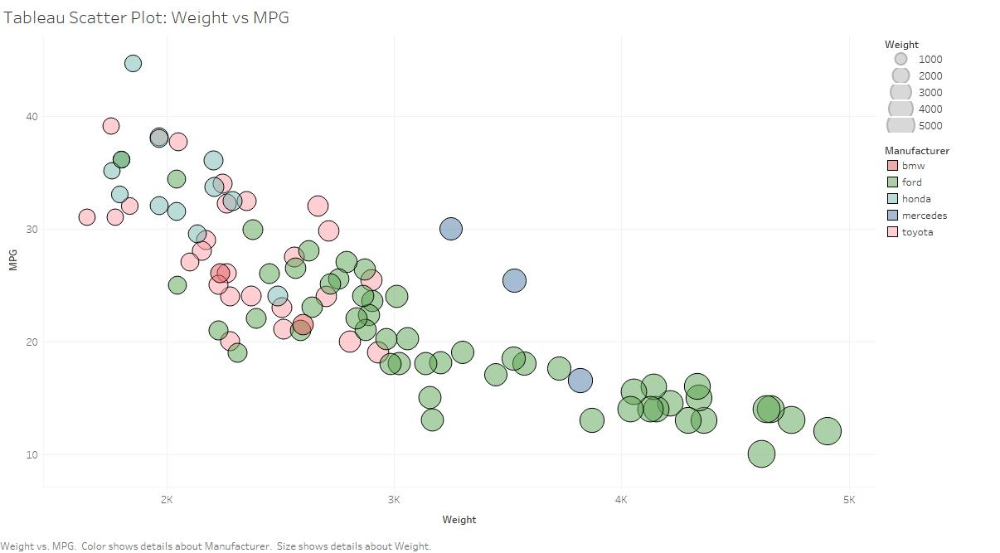
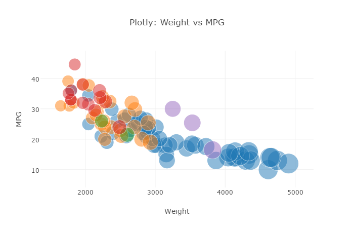
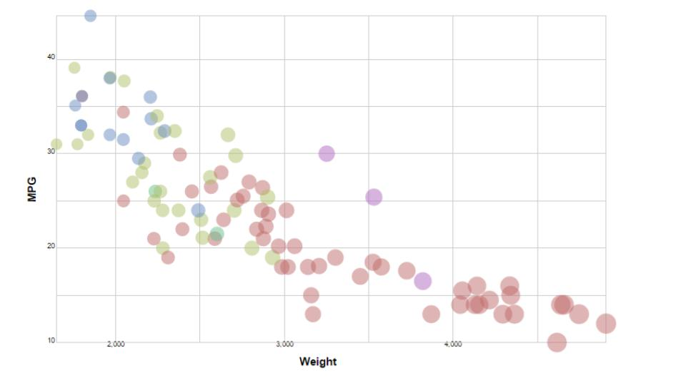
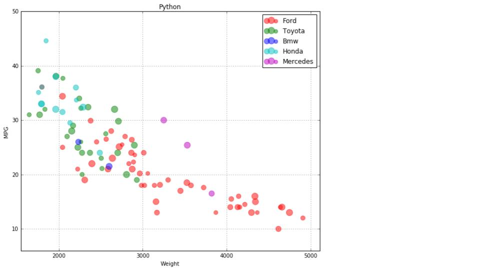

# 02-DataVis-10ways

# R + ggplot2 + R Markdown

R is a language primarily focused on statistical computing.
ggplot2 is a popular library for charting in R.
R Markdown is a document format that compiles to HTML or PDF and allows you to include the output of R code directly in the document.

To visualized the cars dataset, I made use of ggplot2's `geom_point()` layer, with aesthetics functions for the color and size.

While it takes time to find the correct documentation, these functions made the effort creating this chart minimal.

# d3...

(And so on...)

Rachel Murphy
Homework 2

#d3
Visualization 1/10: 

Sources used:
https://bl.ocks.org/d3noob/6f082f0e3b820b6bf68b78f2f7786084
https://bl.ocks.org/mbostock/3887118

It is fairly easy to find examples specific to scatter plots for D3. But it is difficult to find the correct version of d3, many of the online examples use version 3 which does not translate over to version 4. It is pretty easy to look up the API of version for to identify the differences in the versions.

This is a very versitile and straightforward way to make a scatterplot and allows for a lot of variations. 

It was also fairly straightforward to import a csv file, also allowing you to ignore any of the extra unnecessary data.

#Python-MatPlotLib
Visualization 2/10:

I have never used python before so it took some time to get the hang of it. Since it is a highly used language it was very easy to find examples and tutorials for creating a scatter plot. Importing the csv file was also simple because of the large amount of online documentation for python.

I downloaded the WinPy which came with many mathematical and scientific packages, making it simple to create a plot.

I found using python to be  a little easier and more straightforward than using D3, but I have also heard that D3 has a fairly steep learning curve.

#R
Visualization 3/10:

Sources Used:
http://www.statmethods.net/graphs/scatterplot.html
http://www.statmethods.net/advgraphs/parameters.html

I am so glad I took the time to look at R. I have never used this language, but it was very simple to use for creating a scatter plot. I was amazed at how easy it was to input the data, view the data I inputted, and create a graph of it.

-- note: when viewed within RStudio, the graph only has tick numbers at 10,20,30... and the points are larger, but when I open it in an enlarged window, more ticks are added and the points shrink.

#ggPlot2
Visualization 4/10:

Sources used:
http://docs.ggplot2.org/current/geom_point.html

Once I got the hang of R this was incredibly easy.

If I thought R was easy, this was even more amazing. This was incredibly simple. I really like how R studio shows you a table version of the imported csv file, making it easy to reference. It is also easier to find documentation and examples for ggPlot than for strictly using R.

#Plotly - Python
Visualization 5/10:
 

Plotly has a feature of running the code from a python notebook as well as providing the code from a plot. When providing the code though, the csv file is imported into the code.

#Excel
Visualization 6/10:

Since Excel is commonly used, it is very easy to find help and tutorials. Data is often stored in excel sheets which makes it an easy tool to work with as well. The interface of excel makes it one of the easiests visualization tools to import data.

I found it frustrating to work with excel because it is something that you always assume you know how to work, so I tried to work around errors myself, instead of just looking up how to do something correctly.

#Tableau
Visualization 7/10

This is by far the easiest to import a CSV file into. I also love the interface and how it lets you select various data sections for variables in your chart. The "Show me" feature is also fun to play around with, giving you different angles to look at your data.

This was the first one that I did not have to look up examples for to be able to figure out how to get a desired result. I wish I had looked at this one first!

#Plotly
Visualization 8/10:

As of now, plotly and tableau are tied as my favorites as far as user interaction goes. It is very straightforward, and again, did not require outside help to be able to get the plot graphed.

Additionally, it seems that you can view the code for plotly in various languages (R, python....). I did not look much into this feature, but it seems like a useful addition. The online workspace shows very detailed and more complex looking examples. Importing the csv file was simple. The only slight difficulty was figuring out the filter and tracer portions that allowed the points to be set to other colors based on a data.

#RawGraphs
Visualization 9/10:

Seems like this has potential, but I did not enjoy using RawGraphs the way I did Plotly. The the section to import a CSV file did not work, even copy and paste from the excel sheet did not work either. The parser only worked when I copied the data from a .txt editor.
Additonally, some of the features, like setting opacity had to be done manually. The provided svg file at the bottom of the graph allowed for it to be put in an html file and manually editted.

#Python - Pandas
Visualization 10/10:

Pandas offers a different way to parse and incorporate the csv file into a python notebook. Otherwise, it is pretty similar, if not a little easier, than using matplotlib alone with python.

Technical and Design Acheivments:
- Until this class I only worked with Rackett and Java
	- I continued learning JavaScript
	- I learned Python
	- I learned R
- Before this assignment I did not understand what packages and libraries for programing languages were.

- In cases like Raw Graphs I was able to manually edit the code to add opacity features to the image.