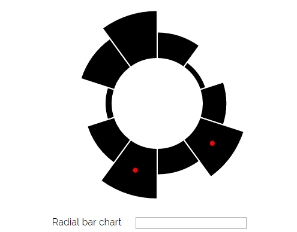

Assignment 3 - Replicating a Classic Experiment  
===

Authors: Fiona Heaney and Rachel Murphy  
Link to project - http://fhheaney.github.io/03-Experiment/index.html 

Collaboration
---

Fiona - Created bar_chart and radial_bar code. Set up index and form html code as well as css and linked all files together. Handled progression through pages, result viewing, and answer recording throughout experiment. 

Rachel - Created pie chart. Set up Excel sheet for answer tracking. Found ten participants for experiment. Calculated bootstrapped confidence intervals, error scores, and generated analysis with corresponding graphs. 

The Experiment 
---
For our version of the Cleveland/McGill Experiment, we decided to test bar charts, pie charts, and radial bar charts against each other to see if the combination of a bar and pie charts would have increased performance over its two ancestors. Users begin by landing on our index page (picture below) where directions are provided and the user can begin the experiment. 

After accepting, the user sees one of each of the visualizations listed above with input boxes below. We had ten participants and each completed sixty trials with random data, marked points, and order of appearance. The following screenshots are ordered from best performance to worst performance. 

**Bar Chart** - Avg error rate of 1.763

**Pie Chart** - Avg error rate of 2.431

**Radial bar chart** - Avg error rate of 2.697

At the end of each trial, the results were collected and compiled into a CSV file. To measure the accuracy of a participant's responses, a log scale was used. The log error was calculated using the same formula as in the Cleveland and McGill experiment; (log2(|reported_percent - actual_percent| + 1/8)). The average log error for each chart was calculated as well as a bootstrapped 95% confidence interval. The results proved that bar charts are the most effective, followed by pie charts, and radial bar charts. The bootstrapped confidence intervals for each type of chart are included below. 
**Bar Chart**  

**Pie Chart**  

**Radial bar chart**  

**Average log error** 

Additional Notes 
---
If you want to download a local copy, navigate to localhost:8080/index.html if you want to see landing page otherwise it defaults to form.html

Technical Achievements 
---
- Use of JavaScript for graph updating eliminates need for full page reload 
- Markings on all charts centered and easy to understand via use of arc centroid for pie and radial bar chart

Design Achievements 
---
- CSS styling from scratch includes centered form elts, stylized buttons, and imported Google fonts
- Each page includes one type of each graph with randomized divs in order to reduce the number of pages the user must proceed through
- Page landing and results print out stylized for readability
