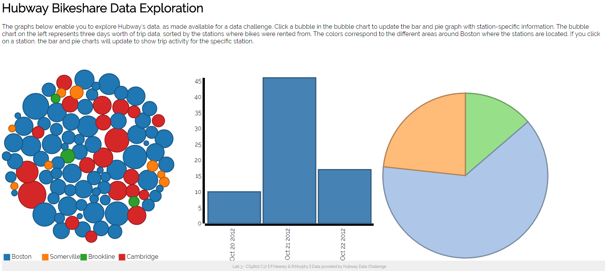

Assignment 4 - Visualizations and Multiple Views  
===
Authors: Fiona Heaney and Rachel Murphy 
Link to project - http://fhheaney.github.io/04-MapsAndViews/

---

Collaboration
---

Fiona: BubbleChart and the dispatch function.
Rachel: Created the bar and pie chart and nested the data.

---

Description
---
Our multiple view visualization uses data collected from Metro-Boston's Bike share Program, Hubway. We selected a portion of the data to analyze in this assignment.
The bubble chart shows all of the available bike stations. Each bubble is color coded to its specific regional location, Boston, Cambridge, Brookline, and Somerville. The radius of the bubbles are based on the amount of activity seen at each of the stations.

Clicking one of the station bubbles alters the data shown on the bar and pie chart. Each chart shows the activity level (based on number of bike rentals started) for the selected station over a three day period.

Technical Achievements 
---
- Implementing a bubble chart to depict each of the bike stations.
- Nesting and filtering the data to allow for the information to be viewed at various levels.
- Using dispatch events to call for the visualization of different sets of information.

Design Achievements 
---
- Color coded each of the bubbles in the bubble chart to match the individual stations by their location.
- Added in tool tips for each of the charts to increase the amount of data available to the user.
- Added in transitions for switching between station views across all three visualizations.

# References:
###Dispatch Events:
* https://bl.ocks.org/mbostock/5872848
* http://clhenrick.io/d3-v4-general-update-pattern-punchcard-chart/

###Nesting Data:
* http://learnjsdata.com/group_data.html
* https://bost.ocks.org/mike/nest/

###Bubble Chart
* http://vallandingham.me/bubble_chart/

###Data
*http://hubwaydatachallenge.org/

