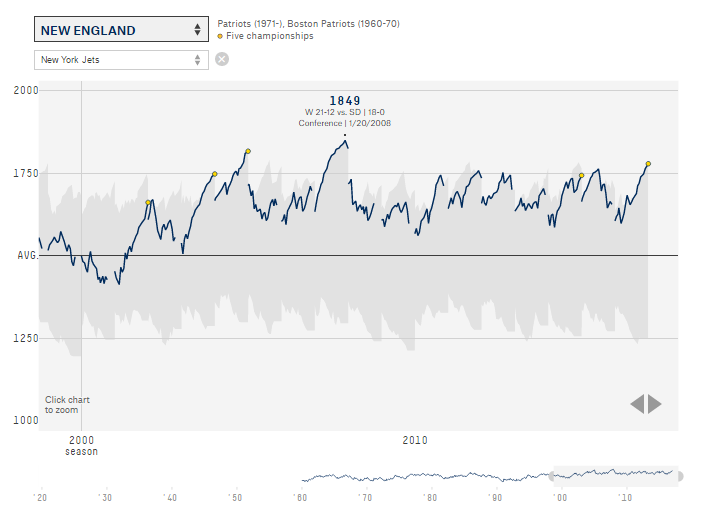

# Week 6 Reflection
## Rachel Murphy

## The Complete History of the NFL

Source: https://projects.fivethirtyeight.com/complete-history-of-the-nfl/

This visualization is on the FiveThirtyEight website. It shows each NFL teams rankings throughout the entire NFL history. The rankings are based on Elo, a method of measuring a teams strength during each game. All 30,000 games of the NFL's history were ranked and plotted for each individual team.

The visualization allows you to select the team you would like to view from a dropdown menu. I thought it was a really good design to allow for old, defunct, teams to be selected and viewed in their portion of history. Additionally, it was also awesome that the data kept track of team names changing. For example, when you select the New England Patriots, data for the 1960-1970 Boston Patriots are also provided.

As a way to avoid change blindness when selecting and viewing various teams, the visualization allows you to compare selected teams. Not only does this eliminate the change blindness, but it prevents clutter by only showing the users teams of interest.

I also thought it was really smart concept and helpful to the viewer that the grayed out background shows the worst and best Elo scores for each season, helping the viewer get a general comparison to the rest of the NFL at that time.

The zoom feature is a nice addition as well as the bottom bar that acts as a timeline to help you figure out where you have zoomed in.